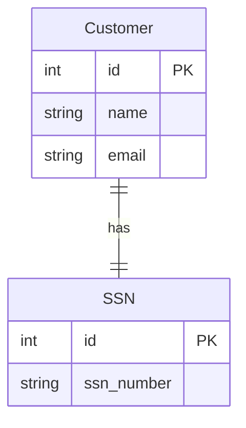
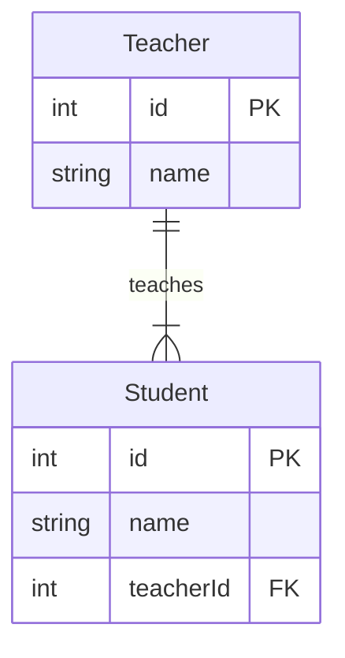
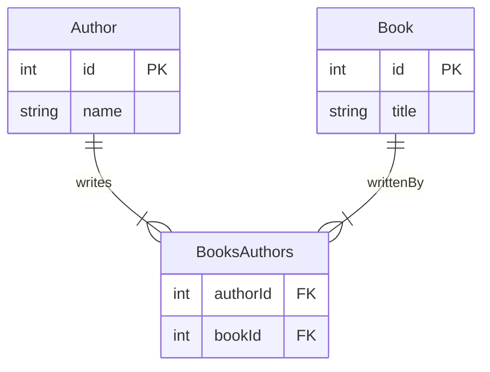

# Entity-Relationship Diagrams (ERDs)

Entity-Relationship Diagrams (ERDs) are a fundamental part of database design. They visually represent the relationships between entities (tables) in a database. Here, we'll explore three types of relationships: one-to-one, one-to-many, and many-to-many.

## One-to-One Relationship

In a one-to-one relationship, each entity in one table is related to a single record in another table.

### Example: Customer and SSN

Each customer has a unique Social Security Number (SSN), and each SSN is associated with exactly one customer.

## One-to-Many Relationship

In a one-to-many relationship, a record in one table can be related to multiple records in another table.

### Example: Teacher and Students

A teacher can teach multiple students, but each student is taught by only one teacher.

## Many-to-Many Relationship

In a many-to-many relationship, records in one table can be associated with multiple records in another table, and vice versa. This often requires a junction table.

### Example: Authors and Books

Authors can write multiple books, and each book can be written by multiple authors. The `BooksAuthors` table acts as a junction table.

---

## Conclusion

Understanding these relationships is crucial for designing efficient and effective databases. One-to-one relationships are used for tightly connected data; one-to-many for cases where a single record relates to multiple records in another table; and many-to-many relationships, managed with a junction table, are used when records in two tables can have multiple associations with each other.